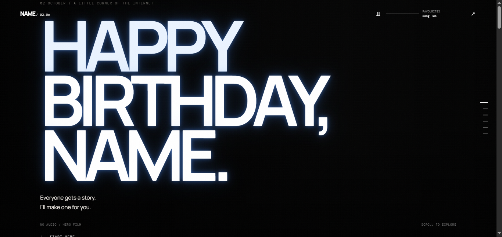
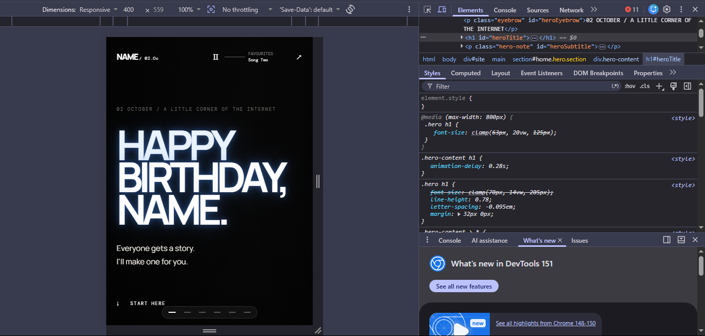
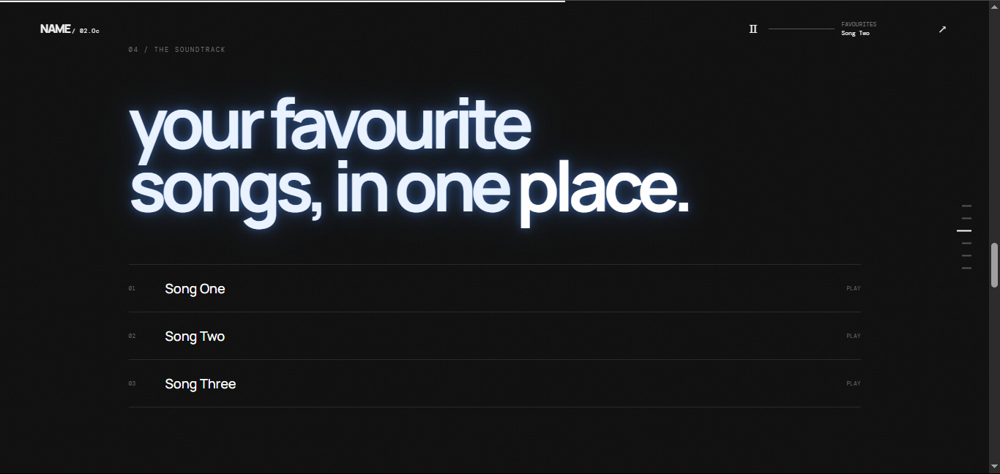
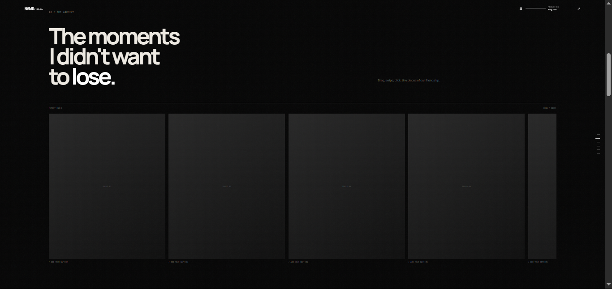

# Birthday Website

A little birthday website template I made for turning a normal birthday message into something more personal.

The idea is to have one place for the photos, videos, songs, memories and random little things that make the person special.

It is made to be easy to customise, even if you don't know much about coding.

---

## What is included?

- Birthday intro / hero section
- Background video
- Music player
- Photo archive
- Video memories
- Family, Friends and Us sections
- Rotating thoughts
- Lore / easter egg section
- Scroll animations
- Hover effects
- Mobile + desktop layouts
- GitHub Pages support
## Preview

### Desktop



### Mobile



### Music player



### Memories


---

# Getting started

## 1. Download the project

On GitHub, click:

**Code → Download ZIP**

Extract the ZIP somewhere on your computer.

---

## 2. Open it in VS Code

Open the extracted folder in VS Code.

You should see something like:

```text
birthday-website/
│
├── index.html
├── content/
├── css/
├── js/
├── media/
└── docs/
```

---

## 3. Run it

The easiest way is to use the **Live Server** extension in VS Code.

Install Live Server, then:

**Right click `index.html` → Open with Live Server**

The website should open in your browser.

---

# Customising the website

Most of the things you'll want to change are inside:

```text
content/site.js
```

You normally don't need to mess with the main JavaScript files.

---

# 1. Change the name

Open:

```text
content/site.js
```

Find:

```js
name: "NAME"
```

Change it to the person's name.

Example:

```js
name: "Alex"
```

---

# 2. Change the birthday

Find:

```js
birthday: "02 OCTOBER"
```

Change it to whatever you want displayed.

Example:

```js
birthday: "14 MAY"
```

---

# 3. Change the main birthday message

In `site.js`, find:

```js
hero: {
```

Inside it you'll find the main text for the first screen.

It will look something like:

```js
hero: {
  eyebrow: "A LITTLE SOMETHING",
  title: "HAPPY<br>BIRTHDAY",
  subtitle: "A small corner of the internet<br>made just for you."
}
```

Change the text to whatever fits your person.

### About `<br>`

`<br>` means a line break.

For example:

```html
HAPPY<br>BIRTHDAY
```

will appear as:

```text
HAPPY
BIRTHDAY
```

---

# 4. Add photos

Put your images inside:

```text
media/photos/
```

For example:

```text
media/photos/
├── 01.jpg
├── 02.jpg
├── 03.jpg
└── 04.jpg
```

Then open:

```text
content/site.js
```

Find the photo list.

A photo entry looks like:

```js
{
  file: "01.jpg",
  caption: "That day."
}
```

Change the filename and caption.

For example:

```js
{
  file: "birthday.jpg",
  caption: "The birthday."
}
```

The filename in the code must match the actual filename.

If your file is:

```text
birthday.jpg
```

then this works:

```js
file: "birthday.jpg"
```

but this does not:

```js
file: "Birthday.jpg"
```

Keep filenames simple. I recommend lowercase names without spaces.

---

# 5. Family / Friends / Us photos

The website has separate sections for:

- Family
- Friends
- Us

The photos still go inside:

```text
media/photos/
```

The section information is controlled from:

```text
content/site.js
```

For example:

```js
family: {
  title: "FAMILY",
  description: "The people who have always been there.",
  photos: ["01.jpg", "02.jpg", "03.jpg"]
}
```

You can change:

- title
- description
- photos

The Friends and Us sections work in the same way.

---

# 6. Add videos

Put your videos inside:

```text
media/videos/
```

Example:

```text
media/videos/
├── memory-01.mp4
├── memory-02.mp4
└── memory-03.mp4
```

Then add them to the video list in:

```text
content/site.js
```

Example:

```js
{
  file: "memory-01.mp4",
  label: "THAT DAY"
}
```

The video cards support:

- Hover playback
- Mute / unmute
- Fullscreen
- Looping

### Keep videos reasonably small

Videos can get huge very quickly.

Compress them before adding them if necessary.

---

# 7. Add songs

Put your audio files inside:

```text
media/music/
```

Example:

```text
media/music/
├── song-01.mp3
├── song-02.mp3
└── song-03.mp3
```

Then find the `songs` section in:

```text
content/site.js
```

It looks like:

```js
songs: [
  { title: "YOUR SONG 01", file: "song-01.mp3" },
  { title: "YOUR SONG 02", file: "song-02.mp3" },
  { title: "YOUR SONG 03", file: "song-03.mp3" }
]
```

Change the titles and filenames.

For example:

```js
songs: [
  { title: "Favourite Song", file: "song-01.mp3" },
  { title: "Another One", file: "song-02.mp3" },
  { title: "Our Song", file: "song-03.mp3" }
]
```

The filename has to match the actual MP3 file.

Only use audio you have permission to distribute if you're putting the files in a public repository.

---

# 8. Hero background video

The large video playing behind the first screen goes here:

```text
media/hero/
```

Name the file:

```text
hero.mp4
```

So the final path should be:

```text
media/hero/hero.mp4
```

For the best result, use:

- MP4
- H.264
- compressed video
- no audio

The hero video is intended to be a quiet background.

---

# 9. Change the thoughts

In `content/site.js`, find:

```js
thoughts: {
```

There is a list of phrases used by the typewriter effect.

You can replace them with your own.

Example:

```js
rotating: [
  "Some people make ordinary days better.",
  "Some memories stay with you.",
  "Today is yours.",
  "Here's to another year."
]
```

Keep the phrases inside quotation marks and separate them with commas.

---

# 10. Change the Lore passphrase

The Lore section has a passphrase which unlocks the hidden section.

You can change it to whatever you want.

### Important

This is an easter egg, **not real security**.

The website runs in the user's browser, so the passphrase can be found by someone inspecting the website files.

Don't use it to protect:

- Real passwords
- Accounts
- Private documents
- Financial information
- Anything actually sensitive

It's just meant to make the birthday website more fun.

---

# 11. Changing the design

Most of the visual styling is inside:

```text
css/style.css
```

This is where you can change things like:

- Fonts
- Text sizes
- Spacing
- Borders
- Backgrounds
- Glow effects
- Animations
- Mobile styling

If you're new to CSS, change one thing at a time and refresh the website.

---

# Where everything is

The easiest way to remember the project is:

```text
content/site.js     → Names, text and website content

media/photos/       → Photos

media/videos/       → Videos

media/music/        → Songs

media/hero/         → Hero background video

css/style.css       → Design and appearance

js/                 → Website behaviour
```

The full structure is:

```text
birthday-website/
│
├── index.html
│
├── content/
│   └── site.js
│
├── css/
│   └── style.css
│
├── js/
│   ├── main.js
│   ├── music.js
│   └── gallery.js
│
├── media/
│   ├── hero/
│   ├── photos/
│   ├── videos/
│   └── music/
│
└── docs/
```

---

# Mobile

The website is designed to work on both desktop and mobile.

Still, always test your changes on both.

Something that looks great on a laptop can sometimes look completely different on a phone.

If you need to change responsive styling, most of it is in:

```text
css/style.css
```

---

# Putting it on GitHub

If you want to host your website using GitHub Pages:

First create a GitHub repository.

Then, from the project folder:

```bash
git add .
```

```bash
git commit -m "Update website"
```

```bash
git push
```

If this is your first time using Git, check GitHub's documentation for setting up Git and authentication.

---

# GitHub Pages

After pushing your project:

Go to:

**Repository → Settings → Pages**

Under **Build and deployment**, choose:

```text
Deploy from a branch
```

Select:

```text
main
/
```

Then save.

GitHub will build the website and give you a URL.

It will look something like:

```text
https://USERNAME.github.io/REPOSITORY/
```

It may take a little while after the first deployment.

---

# Custom domain

You can also connect a domain you bought to the GitHub Pages website.

For example:

```text
happybirthdayalex.com
```

Go to:

**Repository → Settings → Pages**

and look for:

**Custom domain**

You'll also need to configure the DNS records with the company you bought the domain from.

---

# If something isn't working

The most common problem is a filename not matching.

### Image missing?

Check:

```text
media/photos/
```

and make sure the filename in `site.js` is exactly the same.

### Video missing?

Check:

```text
media/videos/
```

and make sure the filename matches.

### Song not playing?

Check:

```text
media/music/
```

and make sure the MP3 filename matches the one in `site.js`.

### Website stuck on the loader?

Open the browser developer tools:

```text
F12 → Console
```

Look for the first red error.

Usually the first error is the useful one.

Don't start changing random files if you aren't sure what the error means. It normally makes things worse.

---

# A note about public GitHub repositories

If your repository is public, the files inside it are public too.

That includes:

- Photos
- Videos
- Songs
- Documents
- Anything else you upload

Don't put passwords, API keys, tokens or genuinely private information inside a public repository.

The Lore passphrase should not be treated as security.

---

# Built with

This project mainly uses normal web technologies:

- HTML
- CSS
- JavaScript
- HTML5 audio/video
- IntersectionObserver
- CSS animations
- GSAP / ScrollTrigger where used

The project is intentionally kept fairly simple so it can be changed without having to understand the entire project first.

---

# Made by

Axzy/Apple

GitHub:

https://github.com/arjunrajawat1029-cpu

---

Have fun with it.

Add the embarrassing photos.

Put in the songs that actually mean something.

Change the text.

Make the whole thing ridiculously specific to the person you're making it for.
meow and take care lol

That's kind of the point.
